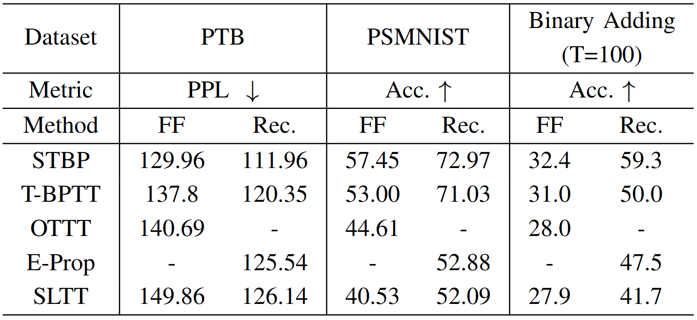
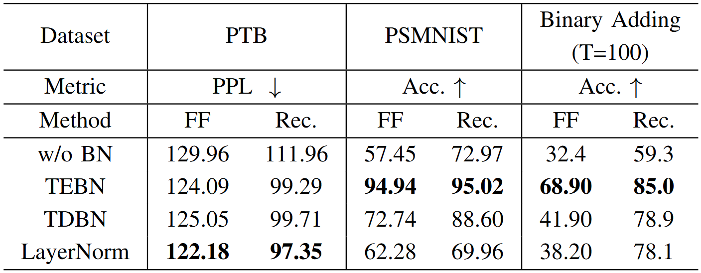
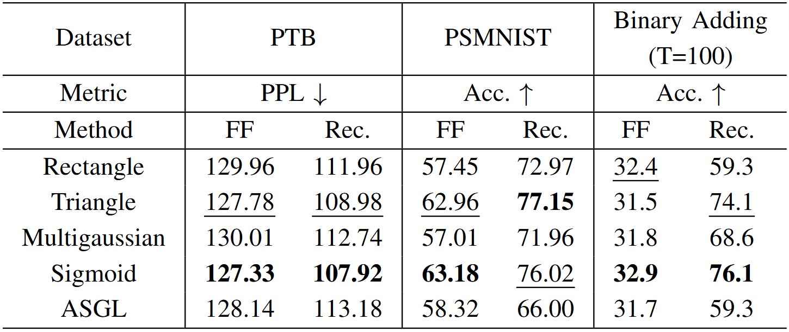
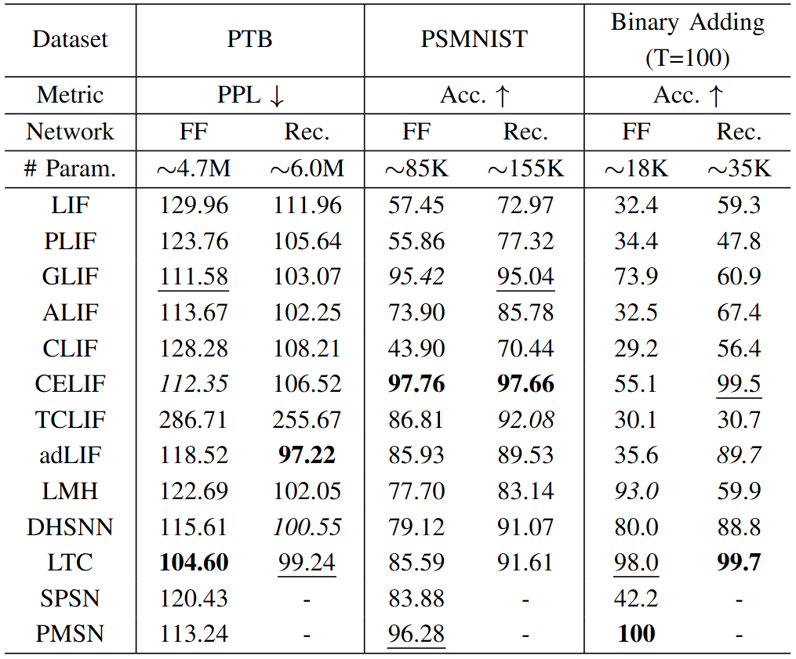

# Neuromorphic Sequential Benchmark

This open-source initiative sets a benchmark for evaluating the capability of neuromorphic models to process **extended temporal sequences**. We have carefully selected datasets that meet our theoretical standards to effectively test the capability for handling long temporal sequences. Additionally, our project also introduces a **brain-inspired modeling framework**, complete with **acceleration modules**, which streamlines both the definition and application of models. To aid in the utilization of our framework, we provide detailed examples. We welcome contributors to enrich our benchmark by sharing their expertise on **brain-inspired modules**, **datasets**, and **other related resources**.

## Quick Start

Clone this repository by running the following command:

```shell
git clone https://github.com/liyc5929/neuroseqbench.git
```

After cloning, navigate to the repository's directory and install the requirements listed below:

```shell
torch                    2.2.0+cu121
torchaudio               2.2.0+cu121
torchvision              0.17.0+cu121
```

```
python train_ptb.py --nlayers 2 --dataset PTB --data-path ./datasource/ --epochs 100 --batch-size 20 --time-step 70 --emb-dim 400 --hidden-dim 1100 --name PTB_LIF
python train_ptb.py --nlayers 2 --dataset PTB --data-path ./datasource/ --epochs 100 --batch-size 20 --time-step 70 --emb-dim 400 --hidden-dim 1100 --recurrent --name PTB_RLIF

python train_psmnist.py --dataset psmnist --batch-size 256 --lr 5e-3 --decay 1 --alpha 1 --step-lr --optim adam --time-step 784 --amp --name PSMNIST_LIF
python train_psmnist.py --dataset psmnist --batch-size 256 --lr 3e-3 --decay 0.5 --alpha 0.6 --threshold 0.5 --time-step 784 --step-lr --optim adam --recurrent --amp  --name PSMNIST_RLIF
```


The file structure of the repository is outlined below. The `network` and `utils` components serve as the primary interfaces for contributors wishing to add their own features:

```
/src/benchmark/
├── README.md
├── requirements.txt
├── __init__.py
├── framework/
│   ├── kernel/
│   │   ├── __init__.py
│   │   ├── accelerationkernel.so
│   │   ├── accelerationkernel.pyd
│   ├── network/
│   │   ├── __init__.py
│   │   ├── ann_layer
│   │   ├── snn_layer
│   │   ├── structure
│   │   └── trainer
│   ├── utils/
│   │   ├── __init__.py
│   │   ├── criterion
│   │   ├── dataset
├── configs/
│   ├── __init__.py
│   ├── benchmark_config1.toml
│   └── benchmark_config2.toml
└── experiments/
    ├── __init__.py
    ├── experiment1.py
    └── experiment2.py
```

The table below lists several components along with their instances. These examples illustrate the roles these components play within the `framework`.

| Components         |                  Description / Instances                   |
| ------------------ | :--------------------------------------------------------: |
| network/ann_layers |                    Normalization Layers                    |
| network/snn_layers |                LIF, ALIF, PLIF, GLIF, etc.                 |
| network/trainer    |    Surrogate Gradient Functions, STBP, SLTT, OTTT, etc.    |
| utils/dataset      | Penn Treebank, Permuted Sequential MNIST, DvsGesture, etc. |


## Experimental Results

This section presents partial results from our main experiments conducted on selected benchmarks.

- Comparison of Different Propagation Methods on Selected Benchmarks

- Comparison of Different Normalization Operators on Selected Benchmarks

- Comparison of Different Surrogate Functions on Selected Benchmarks

- Comparison of Different Neurons on Selected Benchmarks

We are currently conducting additional experiments for our benchmark and warmly invite contributions from others.


## Contact

If you encounter any problems or have suggestions, please file a report on our GitHub Issues page or contact us at `chenxiang.ma@connect.polyu.hk`.