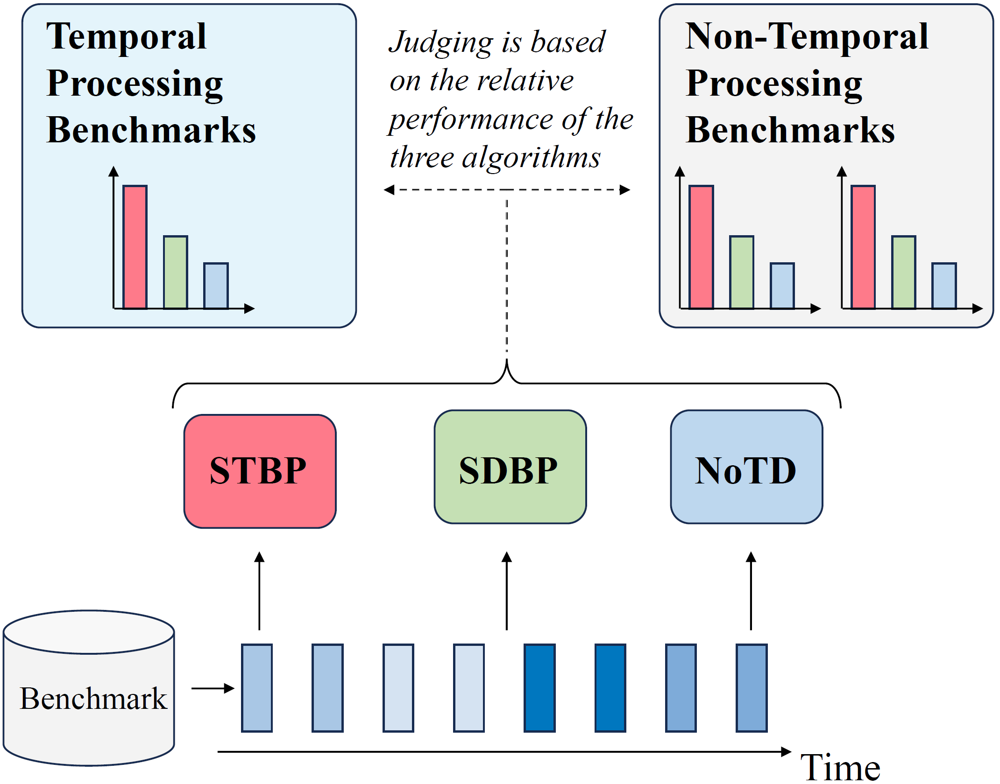
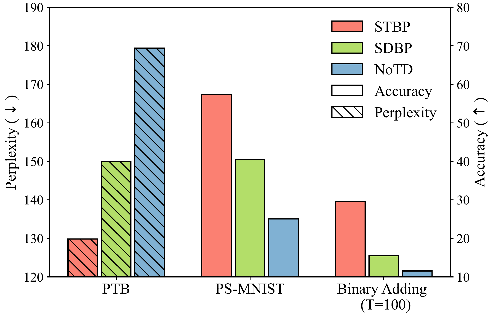

# Neuromorphic Sequential Benchmark


<p align="center">
  <picture>
    
  </picture>
  &nbsp;&nbsp;&nbsp;&nbsp;&nbsp;&nbsp;&nbsp;&nbsp;
  <picture>
    
  </picture>
</p>


This open-source initiative is based on our research, which emphasizes the importance of a more comprehensive evaluation of temporal processing in Spiking Neural Networks (SNNs). To explore more possibilities with SNNs in handling **extended temporal sequences**, we introduce the **Segregated Temporal Probe (STP)**, a method developed to isolate the influence of temporal processing functions, enabling a more accurate assessment of the ability of SNNs to manage long-term temporal dependencies. 

Notably, STP incorporates three learning algorithms: **Spatio-Temporal Backpropagation (STBP)**, **Spatial Domain Backpropagation (SDBP)**, and **No Temporal Domain (NoTD)**, enhancing the evaluation of SNNs in temporal processing. Additionally, three benchmark suites—**Penn Treebank (PTB)**, **Permuted-Sequential MNIST (PS-MNIST)**, and **Binary Adding**—have been adopted to validate the feasibility of these methods. Alongside these benchmarks, the initiative also provides a **brain-inspired modeling framework** that streamlines the definition and application of models, offering detailed examples to assist users effectively. (See <u>the full paper</u> for details.)

To further the development of this initiative, we welcome contributors to share their expertise on **brain-inspired modules**, **datasets**, and **other related resources** that are instrumental for temporal processing.

## Overview

### Main Contents

The table below lists several components along with their instances. These examples illustrate the roles these components play within the `framework`.

<div align="center">

| Components      |                   Description / Instances                    |
| --------------- | :----------------------------------------------------------: |
| network/neuron  |      LIF, ALIF, PLIF, GLIF, Normalization Layers, etc.       |
| network/trainer |              Surrogate Gradient Functions, etc.              |
| utils/dataset   | Penn Treebank, Permuted Sequential MNIST, Binary Adding, etc. |

</div>


### Benchmark Structure

The file structure of the repository is outlined below. The `network` and `utils` components serve as the primary interfaces for contributors wishing to add their own features:

```
/src/benchmark/
├── framework/
│   ├── kernel/
│   │   ├── accelerationkernel.so   # To run on Linux
│   │   └── accelerationkernel.pyd  # To run on Windows
│   ├── network/
│   │   ├── neuron
│   │   ├── structure
│   │   └── trainer
│   └── utils/
│       ├── dataset
│       └── tools
└── experiments/
    ├── 01_STP_on_benchmarks/
    │   ├── logs/
    │   │   ├── log1.txt
    │   │   └── log2.txt
    │   ├── config.toml
    │   └── main.py
    ├── 02_training_algo_on_benchmarks/
    ├── 03_surro_grad_on_benchmarks/
    ├── 04_normalization_on_benchmarks/
    ├── 05_spiking_neuron_on_benchmarks/
    └── 06_neuron_arch_on_benchmarks/
```


## Quick Start

### Setup and Get Involved

To get started, clone this repository by running the following command:

```shell
git clone https://github.com/liyc5929/neuroseqbench.git
```

After cloning, navigate to the repository's directory and install the requirements listed below:

```shell
# Environment dependencies
torch, torchvision, torchaudio

# Configuration management
toml

# Data processing
h5py, tqdm
```

### Examples

The Linux commands for all experiments are contained in the following files:

- `scripts/run_01_STP_on_benchmarks.sh`
- `scripts/run_02_training_algo_on_benchmarks.sh`
- `scripts/run_03_surro_grad_on_benchmarks.sh`
- `scripts/run_04_normalization_on_benchmarks.sh`
- `scripts/run_05_spiking_neuron_on_benchmarks.sh`
- `scripts/run_06_neuron_arch_on_benchmarks.sh`

As an example, to conduct baseline experiments on datasets PennTreebank, PS-MNIST, and Binary Adding using the `run_05_spiking_neuron_on_benchmarks.sh`, execute the following commands:

```shell
# PennTreebank
python runner.py --experiment_name 05_spiking_neuron_on_benchmarks --experiment_item PTB_LIF_feedforward --data_root <path_to_dataset> --device 0
python runner.py --experiment_name 05_spiking_neuron_on_benchmarks --experiment_item PTB_LIF_recurrent --data_root <path_to_dataset> --device 0

# PS-MNIST
python runner.py --experiment_name 05_spiking_neuron_on_benchmarks --experiment_item PSMNIST_LIF_feedforward --data_root <path_to_dataset> --device 0
python runner.py --experiment_name 05_spiking_neuron_on_benchmarks --experiment_item PSMNIST_LIF_recurrent --data_root <path_to_dataset> --device 0

# Binary Adding
python runner.py --experiment_name 05_spiking_neuron_on_benchmarks --experiment_item BinaryAdding_LIF_feedforward --data_root <path_to_dataset> --device 0
python runner.py --experiment_name 05_spiking_neuron_on_benchmarks --experiment_item BinaryAdding_LIF_recurrent --data_root <path_to_dataset> --device 0
```

## Cite & Contact

Please cite it as follows if you have adopted or contributed to this work in your research:

```latex
@article{

}
```

Please file a report on our GitHub Issues page or contact us at `chenxiang.ma@connect.polyu.hk` if you encounter any problems or have suggestions.
