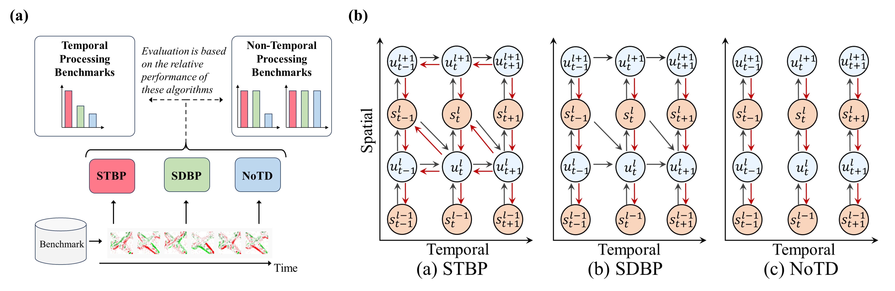

# Neuromorphic Sequential Benchmark

The goal of Neuromorphic Sequential Benchmark is to enable consistent performance comparisons across different approaches to Spiking Neural Networks (SNNs) for temporal processing and to facilitate the tracking of advancements in the field.

This repository contains the source code and implementation details associated with two research papers:
1.  ["Spiking Neural Networks for Temporal Processing: Status Quo and Future Prospects"](https://arxiv.org/abs/2502.09449), presents a systematic evaluation of the temporal processing capabilities of recently proposed SNN approaches and highlights key limitations in existing neuromorphic benchmarks.
2.  ["Neuromorphic Sequential Arena: A Benchmark for Neuromorphic Temporal Processing [IJCAI 2025]"](https://arxiv.org/abs/2505.22035), introduces a comprehensive benchmark suite tailored for neuromorphic temporal processing.

Guidelines are provided to guarantee fair and consistent evaluations of emerging SNN approaches using this repository. We warmly invite researchers and practitioners in the field of neuromorphic temporal processing to engage with us by providing feedback and contributing. By integrating more comprehensive temporal processing benchmarks and advanced SNN methods, your contributions can significantly advance this field. We value your insights and look forward to collaborating to drive innovation together.

## Table of Contents
1. [Spiking Neural Networks for Temporal Processing: Status Quo and Future Prospects](#spiking-neural-networks-for-temporal-processing-status-quo-and-future-prospects)
2. [Neuromorphic Sequential Arena: A Benchmark for Neuromorphic Temporal Processing](#neuromorphic-sequential-arena-a-benchmark-for-neuromorphic-temporal-processing)


## News

- [2025-08]: 🧠 Synchronized with [`NeuroBench`](https://github.com/NeuroBench/neurobench) to support standardized evaluation metrics. See [details](#extended-metrics-support).
- [2025-05]: 🎉 The *Neuromorphic Sequential Arena* paper has been accepted to *IJCAI 2025*. See [details](#neuromorphic-sequential-arena-a-benchmark-for-neuromorphic-temporal-processing).
- [2025-02]: 🚀 Released the *Neuromorphic Sequential Benchmark* alongside our initial arXiv submission. See [details](#spiking-neural-networks-for-temporal-processing-status-quo-and-future-prospects).


---

<h3 align="center"><a name="spiking-neural-networks-for-temporal-processing-status-quo-and-future-prospects"> Spiking Neural Networks for Temporal Processing: Status Quo and Future Prospects </a></h3>

---

> **Abstract:** Temporal processing is fundamental for both biological and artificial intelligence systems, as it enables the comprehension of dynamic environments and facilitates timely responses. Spiking Neural Networks (SNNs) excel in handling such data with high efficiency, owing to their rich neuronal dynamics and sparse activity patterns. Given the recent surge in the development of SNNs, there is an urgent need for a comprehensive evaluation of their temporal processing capabilities. In this paper, we first conduct an in-depth assessment of commonly used neuromorphic benchmarks, revealing critical limitations in their ability to evaluate the temporal processing capabilities of SNNs. To bridge this gap, we further introduce a benchmark suite consisting of three temporal processing tasks characterized by rich temporal dynamics across multiple timescales. Utilizing this benchmark suite, we perform a thorough evaluation of recently introduced SNN approaches to elucidate the current status of SNNs in temporal processing. Our findings indicate significant advancements in recently developed spiking neuron models and neural architectures regarding their temporal processing capabilities, while also highlighting a performance gap in handling long-range dependencies when compared to state-of-the-art non-spiking models. Finally, we discuss the key challenges and outline potential avenues for future research.

## Features

The following illustration depicts the **Segregated Temporal Probe (STP)**, an analytical tool for assessing the effectiveness of neuromorphic benchmarks in evaluating the temporal processing capabilities of SNNs. The STP incorporates three algorithms—Spatio-Temporal Backpropagation (STBP), Spatial Domain Backpropagation (SDBP), and No Temporal Domain (NoTD)—which systematically disrupt the temporal processing pathways within an SNN to elucidate their significance.

<p align="center">
  
</p>

The table below provides a comprehensive overview of the SNN methods that have been evaluated and compared. Each method is detailed with specific examples and their corresponding locations within the repository.

<p align="center">
<table border="1" style="width: 100%; border-collapse: collapse;">
    <thead>
        <tr>
            <th>Components</th>
            <th>Description / Instances</th>
            <th>Repository Location</th>
        </tr>
    </thead>
    <tbody>
        <tr>
            <td>Neuron Model</td>
            <td>LIF, ALIF, PLIF, GLIF, Normalization Layers, etc.</td>
            <td>`neuroseqbench/network/neuron`</td>
        </tr>
        <tr>
            <td>Neural Architecture</td>
            <td>DCLS-Delays, SpikingTCN, Gated Spiking Neuron, Spike-Driven Transformer, etc.</td>
            <td>`neuroseqbench/network/structure`</td>
        </tr>
        <tr>
            <td>Dataset</td>
            <td>Penn Treebank, Permuted Sequential MNIST, Binary Adding, etc.</td>
            <td>`neuroseqbench/utils/dataset`</td>
        </tr>
    </tbody>
</table>
</p>

## Main Results

>
>  The experimental results will be continuously updated to reflect the latest advancements in the field.
>

- Results for different **learning algorithms** on temporal processing tasks. "FF" and "Rec." refer to "feedforward" and "recurrent" architectures, respectively. "PPL" stands for "perplexity".

<table border="1" style="width: 100%; border-collapse: collapse;" align="center">
    <thead>
        <tr>
            <td><strong>Dataset</strong></td>
            <td colspan="2"><strong>PTB<br>($T=70$)</strong></td>
            <td colspan="2"><strong>PS-MNIST<br>($T=784$)</strong></td>
            <td colspan="2"><strong>Binary Adding<br>($T=100$)</strong></td>
        </tr>
        <tr>
            <td><strong>Metric</strong></td>
            <td colspan="2" style="white-space: nowrap;"><strong>PPL $\downarrow$</strong></td>
            <td colspan="2" style="white-space: nowrap;"><strong>Acc. $\uparrow$</strong></td>
            <td colspan="2" style="white-space: nowrap;"><strong>Acc. $\uparrow$</strong></td>
        </tr>
        <tr>
            <td><strong>Method</strong></td>
            <td><strong>FF</strong></td>
            <td><strong>Rec.</strong></td>
            <td><strong>FF</strong></td>
            <td><strong>Rec.</strong></td>
            <td><strong>FF</strong></td>
            <td><strong>Rec.</strong></td>
        </tr>
    </thead>
    <tbody>
        <tr>
            <td>STBP</td>
            <td>129.96</td>
            <td>111.96</td>
            <td>57.45</td>
            <td>72.97</td>
            <td>29.60</td>
            <td>53.35</td>
        </tr>
        <tr>
            <td>T-STBP</td>
            <td>137.8</td>
            <td>120.58</td>
            <td>53.00</td>
            <td>71.03</td>
            <td>23.00</td>
            <td>51.50</td>
        </tr>
        <tr>
            <td>E-prop</td>
            <td>-</td>
            <td>125.54</td>
            <td>-</td>
            <td>52.88</td>
            <td>-</td>
            <td>50.85</td>
        </tr>
        <tr>
            <td>OTTT</td>
            <td>141.77</td>
            <td>-</td>
            <td>44.61</td>
            <td>-</td>
            <td>17.20</td>
            <td>-</td>
        </tr>
        <tr>
            <td>SLTT</td>
            <td>149.86</td>
            <td>-</td>
            <td>40.53</td>
            <td>-</td>
            <td>15.50</td>
            <td>-</td>
        </tr>
    </tbody>
</table>


- Results for different **neuron models** on temporal processing tasks

<table border="1" align="center">
    <thead>
        <tr>
            <td><strong>Network</strong></td>
            <td colspan="2"><strong>PTB<br>($T=70$)</strong></td>
            <td colspan="2"><strong>PS-MNIST<br>($T=784$)</strong></td>
            <td colspan="2"><strong>Binary Adding<br>($T=100$)</strong></td>
        </tr>        
        <tr>
            <td><strong>Metric</strong></td>
            <td colspan="2" style="white-space: nowrap;"><strong>PPL $\downarrow$</strong></td>
            <td colspan="2" style="white-space: nowrap;"><strong>Acc. $\uparrow$</strong></td>
            <td colspan="2" style="white-space: nowrap;"><strong>Acc. $\uparrow$</strong></td>
        </tr>
        <tr>
            <td><strong>Method</strong></td>
            <td><strong>FF</strong></td>
            <td><strong>Rec.</strong></td>
            <td><strong>FF</strong></td>
            <td><strong>Rec.</strong></td>
            <td><strong>FF</strong></td>
            <td><strong>Rec.</strong></td>
        </tr>
    </thead>
    <tbody>
        <tr>
            <td><strong>#Params.</strong></td>
            <td>~5M</td>
            <td>~6M</td>
            <td>~90K</td>
            <td>~160K</td>
            <td>~20K</td>
            <td>~40K</td>
        </tr>
        <tr>
            <td>LIF</td>
            <td>129.96</td>
            <td>111.96</td>
            <td>57.45</td>
            <td>72.97</td>
            <td>29.60</td>
            <td>53.35</td>
        </tr>
        <tr>
            <td>PLIF</td>
            <td>123.76</td>
            <td>105.64</td>
            <td>55.86</td>
            <td>77.32</td>
            <td>29.40</td>
            <td>53.25</td>
        </tr>
        <tr>
            <td>ALIF</td>
            <td>113.67</td>
            <td>102.25</td>
            <td>73.90</td>
            <td>85.78</td>
            <td>40.30</td>
            <td>68.00</td>
        </tr>
        <tr>
            <td>adLIF</td>
            <td>118.52</td>
            <td><strong>97.22</strong></td>
            <td>85.93</td>
            <td>89.53</td>
            <td>42.00</td>
            <td>99.05</td>
        </tr>
        <tr>
            <td>GLIF</td>
            <td>111.58</td>
            <td>103.07</td>
            <td>95.42</td>
            <td>95.04</td>
            <td>90.15</td>
            <td>63.60</td>
        </tr>
        <tr>
            <td>LTC</td>
            <td><strong>104.10</strong></td>
            <td>99.09</td>
            <td>86.33</td>
            <td>90.94</td>
            <td><strong>100.00</strong></td>
            <td><strong>100.00</strong></td>
        </tr>
        <tr>
            <td>SPSN</td>
            <td>120.43</td>
            <td>-</td>
            <td>83.88</td>
            <td>-</td>
            <td>45.70</td>
            <td>-</td>
        </tr>
        <tr>
            <td>TCLIF</td>
            <td>286.71</td>
            <td>255.67</td>
            <td>86.81</td>
            <td>92.08</td>
            <td>19.10</td>
            <td>19.90</td>
        </tr>
        <tr>
            <td>LM-H</td>
            <td>122.69</td>
            <td>102.05</td>
            <td>77.70</td>
            <td>83.14</td>
            <td>99.25</td>
            <td>96.10</td>
        </tr>
        <tr>
            <td>CLIF</td>
            <td>128.28</td>
            <td>108.21</td>
            <td>43.90</td>
            <td>70.44</td>
            <td>19.10</td>
            <td>64.30</td>
        </tr>
        <tr>
            <td>DH-LIF</td>
            <td>115.61</td>
            <td>100.55</td>
            <td>79.12</td>
            <td>91.07</td>
            <td>98.85</td>
            <td>99.35</td>
        </tr>
        <tr>
            <td>CELIF</td>
            <td>112.35</td>
            <td>106.52</td>
            <td><strong>97.76</strong></td>
            <td><strong>97.66</strong></td>
            <td>48.40</td>
            <td><strong>100.00</strong></td>
        </tr>
        <tr>
            <td>PMSN</td>
            <td>113.24</td>
            <td>-</td>
            <td>96.28</td>
            <td>-</td>
            <td><strong>100.00</strong></td>
            <td>-</td>
        </tr>
    </tbody>
</table>


- Results for different **neural architectures** on temporal processing tasks

<table border="1" style="width: 100%; border-collapse: collapse;" align="center">
    <thead>
        <tr>
            <td><strong>Dataset</strong></td>
            <td><strong>PTB<br>($T=70$)</strong></td>
            <td><strong>PS-MNIST<br>($T=784$)</strong></td>
            <td colspan="2"><strong>Binary Adding</strong></td>
        </tr>
        <tr>
            <td><strong>Metric</strong></td>
            <td style="white-space: nowrap;"><strong>PPL $\downarrow$</strong></td>
            <td style="white-space: nowrap;"><strong>Acc. $\uparrow$</strong></td>
            <td style="white-space: nowrap;"><strong>$T \uparrow$</strong></td>
            <td style="white-space: nowrap;"><strong>Acc. $\uparrow$</strong></td>
        </tr>
    </thead>
    <tbody>
        <tr>
            <td><strong>#Params.</strong></td>
            <td>~5M</td>
            <td>~90K</td>
            <td colspan="2">~40K</td>
        </tr>
        <tr>
            <td>LIF</td>
            <td>129.96</td>
            <td>57.45</td>
            <td>100</td>
            <td>34.15</td>
        </tr>
        <tr>
            <td>LIF w/ DCLS-Delays</td>
            <td>89.87</td>
            <td>68.98</td>
            <td>100</td>
            <td>51.85</td>
        </tr>
        <tr>
            <td>TCN</td>
            <td>102.20</td>
            <td>95.10</td>
            <td>1200</td>
            <td>69.95</td>
        </tr>
        <tr>
            <td>SpikingTCN</td>
            <td>114.46</td>
            <td>93.76</td>
            <td>1200</td>
            <td>61.95</td>
        </tr>
        <tr>
            <td>LSTM</td>
            <td>88.08</td>
            <td>92.41</td>
            <td>2400</td>
            <td>100</td>
        </tr>
        <tr>
            <td>Gated Spiking Neuron</td>
            <td>99.98</td>
            <td>80.13</td>
            <td>1200</td>
            <td>29.85</td>
        </tr>
        <tr>
            <td>Transformer</td>
            <td>112.43</td>
            <td>97.64</td>
            <td>2400</td>
            <td>100</td>
        </tr>
        <tr>
            <td>Spike-Driven Transformer ($T_\text{in}=4$)</td>
            <td>152.41</td>
            <td>96.21</td>
            <td>2400</td>
            <td>98.15</td>
        </tr>
        <tr>
            <td>Spike-Driven Transformer ($T_\text{in}=1$)</td>
            <td>327.82</td>
            <td>95.01</td>
            <td>2400</td>
            <td>88.05</td>
        </tr>
    </tbody>
</table>


## Steps to Reproduce Results

### Dependencies
```bash
# Environment dependencies
torch, torchvision, torchaudio

# Configuration management
toml

# Data processing
datasets, h5py, tqdm

# Delay learning model
dcls
```

To incorporate the `neuroseqbench` module into your experimental code, please follow these steps:

```bash
git clone https://github.com/liyc5929/neuroseqbench.git
pip install -e .
```

### Experiments
Each experiment in the paper has a corresponding `toml` configuration in a folder `experiments/segregated_temproral_probe/`. We also provide scripts for all experiments as follows:
- `run_01_STP_on_benchmarks.sh`
- `run_02_training_algo_on_benchmarks.sh`
- `run_03_surro_grad_on_benchmarks.sh`
- `run_04_normalization_on_benchmarks.sh`
- `run_05_spiking_neuron_on_benchmarks.sh`
- `run_06_neuron_arch_on_benchmarks.sh`

Here is an example to reproduce the experiments of spiking neuron models by executing the file `run_05_spiking_neuron_on_benchmarks.sh`,  which contains the following commands:

```bash
# PennTreebank
python ./experiments/runner.py --paper_name segregated_temporal_probe --experiment_name 05_spiking_neuron_on_benchmarks --experiment_item PTB_LIF_feedforward --data_root /benchmark_data --device 0
python ./experiments/runner.py --paper_name segregated_temporal_probe --experiment_name 05_spiking_neuron_on_benchmarks --experiment_item PTB_LIF_recurrent --data_root /benchmark_data --device 0

# PS-MNIST
python ./experiments/runner.py --paper_name segregated_temporal_probe --experiment_name 05_spiking_neuron_on_benchmarks --experiment_item PSMNIST_LIF_feedforward --data_root /benchmark_data --device 0
python ./experiments/runner.py --paper_name segregated_temporal_probe --experiment_name 05_spiking_neuron_on_benchmarks --experiment_item PSMNIST_LIF_recurrent --data_root /benchmark_data --device 0

# Binary Adding
python ./experiments/runner.py --paper_name segregated_temporal_probe --experiment_name 05_spiking_neuron_on_benchmarks --experiment_item BinaryAdding_LIF_feedforward --data_root /benchmark_data --device 0
python ./experiments/runner.py --paper_name segregated_temporal_probe --experiment_name 05_spiking_neuron_on_benchmarks --experiment_item BinaryAdding_LIF_recurrent --data_root /benchmark_data --device 0
```

---

<h3 align="center"><a name="neuromorphic-sequential-arena-a-benchmark-for-neuromorphic-temporal-processing"> Neuromorphic Sequential Arena: A Benchmark for Neuromorphic Temporal Processing </a></h3>

---

> **Abstract:** Temporal processing is vital for extracting meaningful information from time-varying signals. Recent advancements in Spiking Neural Networks (SNNs) have shown immense promise in efficiently processing these signals. However, progress in this field has been impeded by the lack of effective and standardized benchmarks, which complicates the consistent measurement of technological advancements and limits the practical applicability of SNNs. To bridge this gap, we introduce the Neuromorphic Sequential Arena (NSA), a comprehensive benchmark that offers an effective, versatile, and application-oriented evaluation framework for neuromorphic temporal processing. The NSA includes seven real-world temporal processing tasks from a diverse range of application scenarios, each capturing rich temporal dynamics across multiple timescales. Utilizing NSA, we conduct extensive comparisons of recently introduced spiking neuron models and neural architectures, presenting comprehensive baselines in terms of task performance, training speed, memory usage, and energy efficiency. Our findings emphasize an urgent need for efficient SNN designs that can consistently deliver high performance across tasks with varying temporal complexities while maintaining low computational costs. NSA enables systematic tracking of advancements in neuromorphic algorithm research and paves the way for the development of effective and efficient neuromorphic temporal processing systems.

👉 **Supplementary Material** for this paper can be found in the [`neuromorphic_sequential_arena_supp.pdf`](./docs/source/_static/neuromorphic_sequential_arena_supp.pdf) file.

## Steps to Reproduce Results

### Dependencies
```bash
# Environment dependencies
torch, torchvision, torchaudio

# Configuration management
toml

# Data processing
datasets, h5py, tqdm, pandas, scipy

# S4D model
einops

# WISDM dataset
scikit-learn
```

To incorporate the `neuroseqbench` module into your experimental code, please follow these steps:

```bash
git clone https://github.com/liyc5929/neuroseqbench.git
pip install -e .
```

If you've configured a `uv` environment, you can simply run:

```bash
uv sync
```
to install all dependencies at once.

### Data Availability

✅ **All datasets** used in these experiments are hosted on [`our Hugging Face repository`](https://huggingface.co/datasets/liyc5929/neuroseqbench/tree/main/neuromorphic_sequential_arena) to facilitate easy access and ensure reproducibility.

📦 For detailed dataset preparation procedures, including how to download and preprocess the raw data for each task, please refer to the dataset preparation section in the [`experiments/neuromorphic_sequential_arena/README.md`](./experiments/neuromorphic_sequential_arena/README.md).

### Experiments
✨ Before running any experiments, please make sure all dependencies are properly installed for each task.

📌 *Note: For the AD and ASR tasks, please make sure to follow the dependency setup described in their respective* [`AD/README.md`](./experiments/neuromorphic_sequential_arena/AD/README.md) *and* [`ASR/README.md`](./experiments/neuromorphic_sequential_arena/ASR/README.md) files.

Each experiment in the paper  is organized by task and placed under `experiments/neuromorphic_sequential_arena/`. We provide the following scripts to run all experiments for each task:

```bash
bash AL/run_all.sh
bash HAR/run_all.sh
bash EEG-MI/run_all.sh
bash SSL/run_all.sh
bash ALR/run_all.sh
bash AD/run_all.sh
bash ASR/run_all.sh
```

### Extended Metrics Support

We provide built-in support for [NeuroBench metrics](https://github.com/NeuroBench/neurobench), enabling standardized, hardware-agnostic evaluation of neuromorphic models. These metrics have been integrated into our pipeline and tested on selected tasks.  
Implementation is available at [`src/neuroseqbench/utils/criterion/neurobench`](./src/neuroseqbench/utils/criterion/neurobench).

To enable NeuroBench metrics during evaluation, simply add the following flag when running your main script:

```bash
--use-neurobench-metrics
```
Currently supported in NSA benchmark tasks: `AL`, `HAR`, `EEG-MI`, and `SSL`.


## Cite & Contact

If you find this repository helpful for your work, please cite it as follows:

```latex
@article{segregatedtemporalprobe,
    title = {Spiking Neural Networks for Temporal Processing: Status Quo and Future Prospects}, 
    author = {Chenxiang Ma and Xinyi Chen and Yanchen Li and Qu Yang and Yujie Wu and Guoqi Li and Gang Pan and Huajin Tang and Kay Chen Tan and Jibin Wu},
    year = {2025},
    volume = {abs/2502.09449},
    eprinttype = {arXiv},
    eprint = {2502.09449},
}

@article{neuromorphicsequentialarena,
    title = {Neuromorphic Sequential Arena: A Benchmark for Neuromorphic Temporal Processing}, 
    author = {Xinyi Chen and Chenxiang Ma and Yujie Wu and Kay Chen Tan and Jibin Wu},
    year = {2025},
    volume = {abs/2505.22035},
    eprinttype = {arXiv},
    eprint = {2505.22035},
}
```

Please file a report on our GitHub Issues page or contact us at `chenxiang.ma@connect.polyu.hk` if you encounter any problems or have suggestions.
